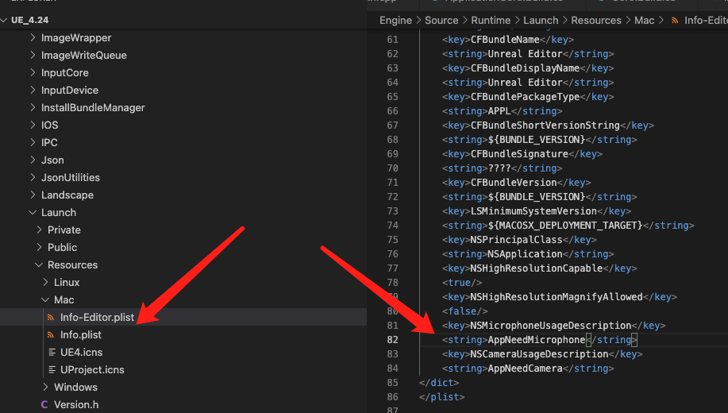

# Video SDK for UE4 使用指南
 
## 适用范围

本规范仅适用于使用游密实时音视频引擎UE4接口开发多人实时语音功能的开发者。

## SDK目录概述

SDK以UE4插件的形式存在

```
└─YoumeVideo
    |
    │  YoumeVideo.uplugin : 插件配置
    |           
    ├─Resources
    │      Icon128.png
    │      
    ├─Shaders
    │      YoumeVideo.usf : 视频渲染shader
    │      
    └─Source
        ├─YoumeVideo : SDK的API开放给C++和蓝图的适配逻辑
        │  │  YoumeVideo.Build.cs
        │  │  
        │  ├─Private
        │  │      YoumeVideo.cpp
        │  │      YoumeVideoAPI.cpp
        │  │      YoumeVideoObserver.cpp
        │  │      YoumeVideoTexture.cpp
        │  │      YoumeVideoTextureResource.cpp
        │  │      YoumeVideoTextureSample.cpp
        │  │      YoumeVideoType.cpp
        │  │      YoumeVideoWork.cpp
        │  │      
        │  ├─Public
        │  │      YoumeVideo.h
        │  │      YoumeVideoAPI.h
        │  │      YoumeVideoObserver.h
        │  │      YoumeVideoTexture.h
        │  │      YoumeVideoTextureResource.h
        │  │      YoumeVideoTextureSample.h
        │  │      YoumeVideoType.h
        │  │      YoumeVideoWork.h
        │  │      
        │  └─VideoSDK
        │      ├─include : SDK底层逻辑接口
        │      │      IYouMeEventCallback.h
        │      │      IYouMeVideoCallback.h
        │      │      IYouMeVoiceEngine.h
        │      │      VoiceEngineCallback.h
        │      │      YouMeConstDefine.h
        │      │      
        │      └─lib : SDK各平台库文件
        │          ├─android
        │          │  │  android-support-v4.jar
        │          │  │  YoumeVideo_UPL.xml
        │          │  │  youme_voice_engine.jar
        │          │  │  
        │          │  ├─arm64-v8a
        │          │  │      libyoume_voice_engine.so
        │          │  │      
        │          │  ├─armeabi
        │          │  │      libyoume_voice_engine.so
        │          │  │      
        │          │  ├─armeabi-v7a
        │          │  │      libyoume_voice_engine.so
        │          │  │      
        │          │  └─x86
        │          │          libyoume_voice_engine.so
        │          │          
        │          ├─ios
        │          │      libffmpeg3.3.a
        │          │      libYouMeCommon.a
        │          │      libyoume_voice_engine.a
        │          │      
        │          ├─macos
        │          │      libffmpeg3.3.a
        │          │      libYouMeCommon.a
        │          │      libyoume_voice_engine.a
        │          │      youme_voice_engine_mac.dylib
        │          │      
        │          ├─x64
        │          │      avcodec-57.dll
        │          │      avdevice-57.dll
        │          │      avfilter-6.dll
        │          │      avformat-57.dll
        │          │      avutil-55.dll
        │          │      D3DCompiler_43.dll
        │          │      d3dx10_43.dll
        │          │      libscreen.dll
        │          │      libx264-152.dll
        │          │      MediaApi.dll
        │          │      postproc-54.dll
        │          │      SDL2.dll
        │          │      swresample-2.dll
        │          │      swscale-4.dll
        │          │      youme_voice_engine.dll
        │          │      youme_voice_engine.lib
        │          │      youme_voice_engine.pdb
        │          │      
        │          └─x86
        │                  avcodec-57.dll
        │                  avdevice-57.dll
        │                  avfilter-6.dll
        │                  avformat-57.dll
        │                  avutil-55.dll
        │                  D3DCompiler_43.dll
        │                  d3dx10_43.dll
        │                  libgcc_s_dw2-1.dll
        │                  libiconv-2.dll
        │                  libscreen.dll
        │                  libx264-152.dll
        │                  MediaApi.dll
        │                  SDL2.dll
        │                  swresample-2.dll
        │                  swscale-4.dll
        │                  youme_voice_engine.dll
        │                  youme_voice_engine.lib
        │                  
        └─YoumeVideoUasge : 视频渲染Shader加载逻辑
            │  YoumeVideoUasge.Build.cs
            │  
            ├─Private
            │      YoumeVideoShaders.cpp
            │      YoumeVideoUasge.cpp
            │      
            └─Public
                    YoumeVideoShaders.h
                    YoumeVideoUasge.h
```

## 插件集成到项目

将YoumeVideo解压到工程目录的Plugins文件夹下, 重新生成VS工程, 在游戏的Build.cs添加 YoumeVideo 依赖, 如下所示 : 

```
PrivateDependencyModuleNames.AddRange(new string[] { "YoumeVideo" });
```

重新编译运行即可

## 打包权限配置

### IOS权限配置

需要在 Project Settings -> IOS -> Additional Plist Data 添加如下权限请求

```
<key>NSMicrophoneUsageDescription</key><string>App需要您的同意,才能访问麦克风</string><key>NSCameraUsageDescription</key><string>App需要您的同意,才能访问麦克风</string>
```

### MAC权限配置

需要修改引擎目录/Engine/Source/Runtime/Launch/Resources/Mac下的Info-Editor.plist和Info.plist两个文件, 添加摄像机与麦克风的权限, 如下 :



注意 : 在这两个文件下添加权限是为了能够在打包Mac包的时候给打出的包添加摄像机与麦克风的权限, 打出的包可以正常运行SDK的功能
但是在编辑器调用SDK功能的话依然还是没有权限的, 请考虑下载引擎源码重新编译引擎, 编译前在xcode添加摄像机与麦克风的权限
