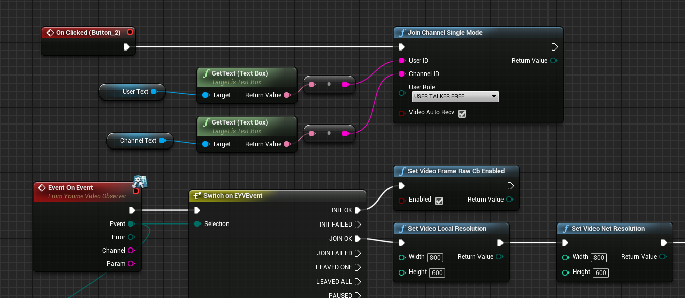
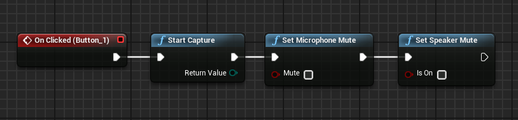
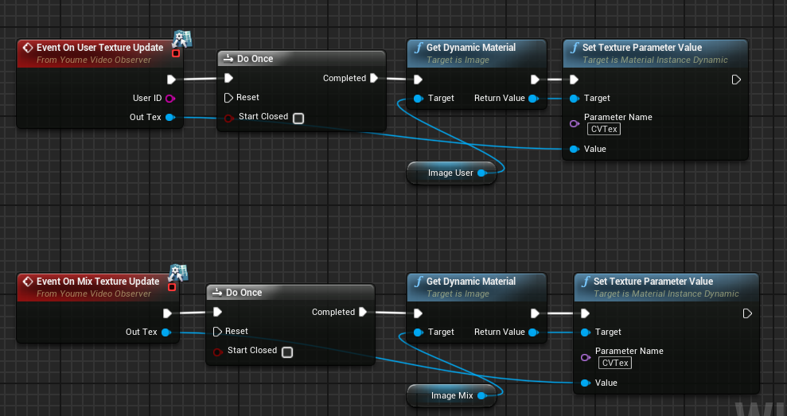

# Video SDK for UE4 典型场景实现方法

## 实现视频通话

###  相关接口

BindObserver : 绑定回调对象
UnbindObserver : 解绑回调对象
Start : 初始化SDK
SetVideoFrameRawCbEnabled : 设置视频编码方式, 需要在加入房间前设置
JoinChannelSingleMode : 加入房间
SetVideoLocalResolution : 设置本地采样大小
SetVideoNetResolution : 设置远端采样大小
StartCapture : 开始摄像头采集
SetMicrophoneMute : 设置麦克风状态
SetSpeakerMute : 设置扬声器状态

###  1.继承YoumeVideoObserver接口类, 绑定回调对象
 
 
###  2.调用Start进行SDK初始化
###  3.初始化返回INIT_OK时调用SetVideoFrameRawCbEnabled传入true
###  4.调用JoinChannelSingleMode加入频道
###  5.返回JOIN_OK后设置SetVideoLocalResolution, SetVideoNetResolution采样大小
 
###  6.调用StartCapture, 调用SetMicrophoneMute与SetSpeakerMute, 都传入false
 
###  7.等待OnUserTextureUpdate和OnMixTextureUpdate接口回调,配置Texture到Imgae的材质
 
###  8.视频通话完成

