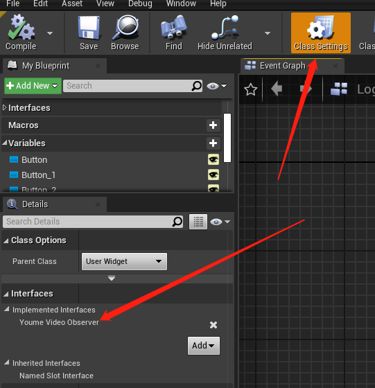
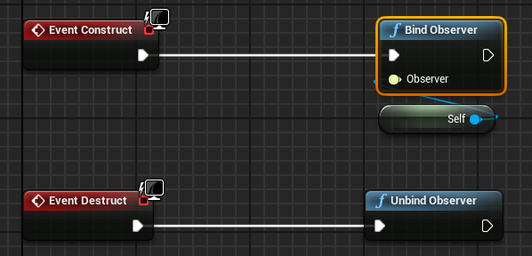
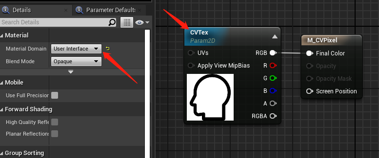
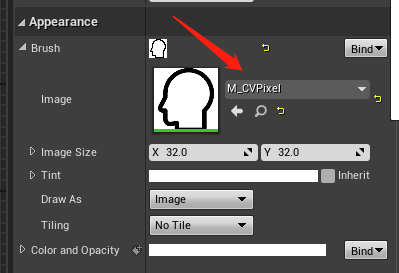
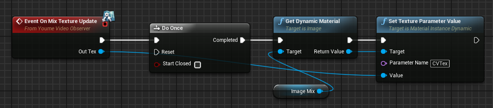

# Video SDK for UE4 接口手册

## 一.API绑定与回调

API的回调需要创建一个接口类YoumeVideoObserver来继承回调事件, 可以在C++实现, 也可以在蓝图实现.

### 1.创建蓝图类继承 YoumeVideoObserver 接口类, 如下创建的UserWidget在ClassSettings内进行配置

 

### 2.在蓝图的构造和析构函数处分别调用绑定和解绑函数

不允许同时绑定多个对象,如果同时绑定多个对象只有最后一个绑定的对象可以获取回调

 

### 3.监听回调

#### 事件回调

* 语法
```
void OnEvent(const EYVEvent& event, const EYVErrorCode& error, const FString& channel, const FString& param);
```

* 需要通过event的类型来处理流程
``` cpp
UENUM(BlueprintType)
enum class EYVEvent : uint8
{
	INIT_OK, ///< SDK初始化成功
	INIT_FAILED,   ///< SDK初始化失败
	JOIN_OK,   ///< 进入语音频道成功
	JOIN_FAILED,   ///< 进入语音频道失败
	LEAVED_ONE,   ///< 退出单个语音频道完成
	LEAVED_ALL,   ///< 退出所有语音频道完成
	PAUSED,   ///< 暂停语音频道完成
	RESUMED,   ///< 恢复语音频道完成
	SPEAK_SUCCESS,   ///< 切换对指定频道讲话成功（适用于多频道模式）
	SPEAK_FAILED,   ///< 切换对指定频道讲话失败（适用于多频道模式）
	RECONNECTING,  ///< 断网了，正在重连
	RECONNECTED,  ///< 断网重连成功
	REC_PERMISSION_STATUS,  ///< 通知录音权限状态，成功获取权限时错误码为YOUME_SUCCESS，获取失败为YOUME_ERROR_REC_NO_PERMISSION（此时不管麦克风mute状态如何，都没有声音输出）
	BGM_STOPPED,  ///< 通知背景音乐播放结束
	BGM_FAILED,  ///< 通知背景音乐播放失败
	//MEMBER_CHANGE              = 15,  ///< 频道成员变化

	OTHERS_MIC_ON,  ///< 其他用户麦克风打开
	OTHERS_MIC_OFF,  ///< 其他用户麦克风关闭
	OTHERS_SPEAKER_ON,  ///< 其他用户扬声器打开
	OTHERS_SPEAKER_OFF,  ///< 其他用户扬声器关闭
	OTHERS_VOICE_ON,  ///< 其他用户进入讲话状态
	OTHERS_VOICE_OFF,  ///< 其他用户进入静默状态
	MY_MIC_LEVEL,  ///< 麦克风的语音级别

	MIC_CTR_ON,  ///< 麦克风被其他用户打开
	MIC_CTR_OFF,  ///< 麦克风被其他用户关闭    
	SPEAKER_CTR_ON,  ///< 扬声器被其他用户打开
	SPEAKER_CTR_OFF,  ///< 扬声器被其他用户关闭

	LISTEN_OTHER_ON,  ///< 取消屏蔽某人语音
	LISTEN_OTHER_OFF,  ///< 屏蔽某人语音

	LOCAL_MIC_ON,  ///< 自己的麦克风打开
	LOCAL_MIC_OFF,  ///< 自己的麦克风关闭
	LOCAL_SPEAKER_ON,  ///< 自己的扬声器打开
	LOCAL_SPEAKER_OFF,  ///< 自己的扬声器关闭

	GRABMIC_START_OK,  ///< 发起抢麦活动成功
	GRABMIC_START_FAILED,  ///< 发起抢麦活动失败
	GRABMIC_STOP_OK,  ///< 停止抢麦活动成功
	GRABMIC_STOP_FAILED,  ///< 停止抢麦活动失败
	GRABMIC_REQUEST_OK,  ///< 抢麦成功（可以说话）
	GRABMIC_REQUEST_FAILED,  ///< 抢麦失败
	GRABMIC_REQUEST_WAIT,  ///< 进入抢麦等待队列（仅权重模式下会回调此事件）
	GRABMIC_RELEASE_OK,  ///< 释放麦成功
	GRABMIC_RELEASE_FAILED,  ///< 释放麦失败
	GRABMIC_ENDMIC,  ///< 不再占用麦（到麦使用时间或者其他原因）

	GRABMIC_NOTIFY_START,  ///< [通知]抢麦活动开始
	GRABMIC_NOTIFY_STOP,  ///< [通知]抢麦活动结束
	GRABMIC_NOTIFY_HASMIC,  ///< [通知]有麦可以抢
	GRABMIC_NOTIFY_NOMIC,  ///< [通知]没有麦可以抢

	INVITEMIC_SETOPT_OK,  ///< 连麦设置成功
	INVITEMIC_SETOPT_FAILED,  ///< 连麦设置失败
	INVITEMIC_REQUEST_OK,  ///< 请求连麦成功（连上了，需等待对方回应）
	INVITEMIC_REQUEST_FAILED,  ///< 请求连麦失败
	INVITEMIC_RESPONSE_OK,  ///< 响应连麦成功（被叫方无论同意/拒绝都会收到此事件，错误码是YOUME_ERROR_INVITEMIC_REJECT表示拒绝）
	INVITEMIC_RESPONSE_FAILED,  ///< 响应连麦失败
	INVITEMIC_STOP_OK,  ///< 停止连麦成功
	INVITEMIC_STOP_FAILED,  ///< 停止连麦失败

	INVITEMIC_CAN_TALK,  ///< 双方可以通话了（响应方已经同意）
	INVITEMIC_CANNOT_TALK,  ///< 双方不可以再通话了（有一方结束了连麦或者连麦时间到）

	INVITEMIC_NOTIFY_CALL,  ///< [通知]有人请求与你连麦
	INVITEMIC_NOTIFY_ANSWER,  ///< [通知]对方对你的连麦请求作出了响应（同意/拒绝/超时，同意的话双方就可以通话了）
	INVITEMIC_NOTIFY_CANCEL,  ///< [通知]连麦过程中，对方结束了连麦或者连麦时间到

	SEND_MESSAGE_RESULT,  ///< sendMessage成功与否的通知，param为回传的requestID
	MESSAGE_NOTIFY,  ///< 收到Message, param为message内容

	KICK_RESULT,  ///< 踢人的应答
	KICK_NOTIFY,  ///< 被踢通知   ,param: （踢人者ID，被踢原因，被禁时间）

	FAREND_VOICE_LEVEL,  ///< 远端说话人音量大小

	OTHERS_BE_KICKED,  ///< 房间里其他人被踢出房间
	//68-71 talk已占用
	SPEAK_RECORD_ON,	///< 扬声器内录开启通知（成功、失败）
	SPEAK_RECORD_OFF,	///< 扬声器内录关闭通知（成功、失败）
	SPEAK_RECORD_RESET,	///< 扬声器内录重启通知（成功、失败）

	EFFECT_PLAY_COMPLETE,   ///< 音效播放完成
	AUDIO_START_FAIL,   ///< 音频启动失败，可能是设备被其他应用占用
	AUDIO_INPUT_DEVICE_CONNECT,   ///< 音频采集设备插入，移动端无效
	AUDIO_INPUT_DEVICE_DISCONNECT,   ///< 音频采集设备拔出，移动端无效

	SWITCH_OUTPUT, ///< 切换扬声器/听筒
	BGM_OR_SPEAR_RECORD, ///< 背景音乐 或者 内录，同一时间，只能打开一个  
	AUDIO_ROUTE_CHANGE, ///< 音频路由改变事件 (YouMeAudioRouteType_t)

	OTHERS_VIDEO_ON, ///< 收到其它用户的视频流

	MASK_VIDEO_BY_OTHER_USER, ///< 视频被其他用户屏蔽
	RESUME_VIDEO_BY_OTHER_USER, ///< 视频被其他用户恢复
	MASK_VIDEO_FOR_USER, ///< 屏蔽了谁的视频
	RESUME_VIDEO_FOR_USER, ///< 恢复了谁的视频
	OTHERS_VIDEO_SHUT_DOWN, ///< 其它用户的视频流断开（包含网络中断的情况）
	OTHERS_VIDEO_INPUT_START, ///< 其他用户视频输入开始（内部采集下开启摄像头/外部输入下开始input）
	OTHERS_VIDEO_INPUT_STOP, ///< 其他用户视频输入停止（内部采集下停止摄像头/外部输入下停止input）

	MEDIA_DATA_ROAD_PASS, ///< 音视频数据通路连通，定时检测，一开始收到数据会收到PASS事件，之后变化的时候会发送
	MEDIA_DATA_ROAD_BLOCK, ///< 音视频数据通路不通

	QUERY_USERS_VIDEO_INFO, ///< 查询用户视频信息返回
	SET_USERS_VIDEO_INFO, ///< 设置用户接收视频信息返回

	LOCAL_VIDEO_INPUT_START, ///< 本地视频输入开始（内部采集下开始摄像头/外部输入下开始input）
	LOCAL_VIDEO_INPUT_STOP, ///< 本地视频输入停止（内部采集下停止摄像头/外部输入下停止input）

	START_PUSH, ///< 设置startPush的返回事件
	SET_PUSH_MIX, ///< 设置setPushMix的返回事件
	ADD_PUSH_MIX_USER, ///< 设置addPushMixUser的返回事件，参数userID
	OTHER_SET_PUSH_MIX, ///< 在自己调用了setPushMix还没停止的情况下，房间内有别人调用setPushMix，自己被踢

	LOCAL_SHARE_INPUT_START, ///< 本地共享视频输入开始
	LOCAL_SHARE_INPUT_STOP, ///< 本地共享视频输入停止
	OTHERS_SHARE_INPUT_START, ///< 其他用户共享视频输入开始
	OTHERS_SHARE_INPUT_STOP, ///< 其他用户共享视频输入停止

	SET_USERS_VIDEO_INFO_NOTIFY, ///< 设置用户接收视频信息给发送方的通知

	OTHER_PLAY_BACKGRAOUND_MUSIC, ///其他人播放背景音乐
	OTHER_STOP_BACKGRAOUND_MUSIC, ///其他人停止背景音乐

	OTHERS_DATA_ERROR, ///< 数据错误
	OTHERS_NETWORK_BAD, ///< 网络不好
	OTHERS_BLACK_FULL, ///< 黑屏
	OTHERS_GREEN_FULL, ///< 绿屏
	OTHERS_BLACK_BORDER, ///< 黑边
	OTHERS_GREEN_BORDER, ///< 绿边
	OTHERS_BLURRED_SCREEN, ///< 花屏
	OTHERS_ENCODER_ERROR, ///< 编码错误
	OTHERS_DECODER_ERROR, ///< 解码错误

	CAMERA_DEVICE_CONNECT, ///< 摄像头设备插入，移动端无效
	CAMERA_DEVICE_DISCONNECT, ///< 摄像头设备拔出，移动端无效

	AUDIO_HOWLING_DETECTION, ///< 检测到啸叫

	// video encode param report
	VIDEO_ENCODE_PARAM_REPORT,
	VIDEO_DECODE_PARAM_REPORT,

	// p2p/server route
	RTP_ROUTE_P2P, ///< P2P通路检测ok, 当前通路为P2P
	RTP_ROUTE_SEREVER, ///< P2P通路检测失败, 当前通路为server转发
	RTP_ROUTE_CHANGE_TO_SERVER, ///< 运行过程中P2P 检测失败，切换到server转发
	RTP_ROUTE_SERVER_WITH_P2P_PROBE, ///< server转发模式下，P2P探测成功

	RECOGNIZE_MODULE_INIT_START, ///< 语音识别初始化开始
	RECOGNIZE_MODULE_INIT_END, ///< 语音识别初始化完成
	RECOGNIZE_MODULE_UNINIT, ///< 语音识别结束
	RECOGNIZE_MODULE_ERR, ///< 语音识别出错

	// for windows/mac share
	LOCAL_SHARE_WINDOW_CLOSED, ///< 共享窗口被关闭
	LOCAL_SHARE_WINDOW_INVSIABLE, ///< 共享窗口被隐藏，不可见
	LOCAL_SHARE_WINDOW_ISICONIC, ///< 共享窗口被最小化
	LOCAL_SHARE_WINDOW_NORMAL, ///< 共享窗口恢复正常
	LOCAL_SHARE_WINDOW_MOVE, ///< 共享窗口位置发生变化

	LOCAL_EOF
};

```

#### 混合(本地)采样回调

* 语法
```
void OnMixTextureUpdate(UYoumeVideoTexture* OutTex);
```

* 参数说明
<font color=red size=2>OutTex</font>：混合或者本地摄像机采集的数据渲染的贴图

#### 远端采样回调

* 语法
```
void OnUserTextureUpdate(const FString& UserID, UYoumeVideoTexture* OutTex);
```

* 参数说明
<font color=red size=2>UserID</font>：频道内其他玩家的id
<font color=red size=2>OutTex</font>：频道内其他玩家采集的视频数据渲染的贴图

#### 采样图像回到使用方式

创建User Interface类型的材质来渲染贴图, 并且把贴图声明为变量



把材质赋予到Image的笔刷上



回调数据时直接把OutTex赋予到材质里的贴图变量即可渲染



## 二.API调用实现

API的调用可使用“UYoumeVideoAPI::XXX()”来直接操作，接口使用的基本流程为初始化->收到初始化成功回调通知->加入语音频道->收到加入频道成功回调通知->使用其它接口->离开语音频道->反初始化，要确保严格按照上述的顺序使用接口. 以下所有方法都定义在UYoumeVideoAPI下, C++和蓝图都可以调用.

### 初始化

* **语法**
```
EYVErrorCode Start(const FString appKey, const FString aPPSecret, EYVRtcServerRegion serverRegionId, const FString extServerRegionName);
```


* **功能**
初始化SDK并且绑定回调。在游戏初始化时调用一次, 不可以调用多次

* **参数说明**
`strAPPKey`：从游密申请到的 app key, 这个你们应用程序的唯一标识。
`strAPPSecret`：对应 strAPPKey 的私钥, 这个需要妥善保存，不要暴露给其他人。
`serverRegionId`：设置首选连接服务器的区域码，如果在初始化时不能确定区域，可以填RTC_DEFAULT_SERVER，后面确定时通过 SetServerRegion 设置。如果YOUME_RTC_SERVER_REGION定义的区域码不能满足要求，可以把这个参数设为 RTC_EXT_SERVER，然后通过后面的参数strExtServerRegionName 设置一个自定的区域值（如中国用 "cn" 或者 “ch"表示），然后把这个自定义的区域值同步给游密，我们将通过后台配置映射到最佳区域的服务器。
`strExtServerRegionName`：自定义的扩展的服务器区域名。不能为null，可为空字符串“”。只有前一个参数serverRegionId设为RTC_EXT_SERVER时，此参数才有效（否则都将当空字符串“”处理）。

* **返回值**
返回YOUME_SUCCESS才会有异步回调通知。

### 关闭SDK

* 语法
```
void Close();
```

* **功能**
在游戏结束时调用一次, 不可以调用多次

### 判断是否初始化完成

* **语法**

```
bool isInited();
```

* **功能**
判断语音引擎是否初始化完成。

* **返回值**
true——初始化完成，false——未初始化或者初始化未完成

### 加入语音频道（单频道）

* **语法**

```
EYVErrorCode joinChannelSingleMode (const FString strUserID, const FString strChannelID, int userRole);
```
* **功能**
加入语音频道（单频道模式，每个时刻只能在一个语音频道里面）。

* **参数说明**
`strUserID`：全局唯一的用户标识，全局指在当前应用程序的范围内。
`strChannelID`：全局唯一的频道标识，全局指在当前应用程序的范围内。
`userRole`：用户在语音频道里面的角色，见YouMeUserRole定义。

* **返回值**
返回YOUME_SUCCESS才会有异步回调通知。

* **异步回调**

```
//涉及到的主要回调事件有：
//YOUME_EVENT_JOIN_OK - 成功进入语音频道
//YOUME_EVENT_JOIN_FAILED - 进入语音频道失败，可能原因是网络或服务器有问题
void  onEvent (const FString strParam);
```

### 加入语音频道（多频道）

* **语法**

```
EYVErrorCode joinChannelMultiMode (const FString strUserID, const FString strChannelID);
```
* **功能**
加入语音频道（多频道模式，可以同时听多个语音频道的内容，但每个时刻只能对着一个频道讲话）。

* **参数说明**
`strUserID`：全局唯一的用户标识，全局指在当前应用程序的范围内。
`strChannelID`：全局唯一的频道标识，全局指在当前应用程序的范围内。

* **返回值**
返回YOUME_SUCCESS才会有异步回调通知。

* **异步回调**

```
//涉及到的主要回调事件有：
//YOUME_EVENT_JOIN_OK - 成功进入语音频道
//YOUME_EVENT_JOIN_FAILED - 进入语音频道失败，可能原因是网络或服务器有问题
void  onEvent (const FString strParam);
```

### 指定讲话频道

* **语法**

```
EYVErrorCode speakToChannel (const FString strChannelID);
```
* **功能**
多频道模式下，指定当前要讲话的频道。

* **参数说明**
`strChannelID`：全局唯一的频道标识，全局指在当前应用程序的范围内。

* **返回值**
返回YOUME_SUCCESS才会有异步回调通知。

* **异步回调**

```
//涉及到的主要回调事件有：
//YOUME_EVENT_SPEAK_SUCCESS - 成功切入到指定语音频道
//YOUME_EVENT_SPEAK_FAILED - 切入指定语音频道失败，可能原因是网络或服务器有问题
void  onEvent (const FString strParam);
```


### 退出指定的语音频道

* **语法**

```
EYVErrorCode leaveChannelMultiMode (const FString strChannelID);
```
* **功能**
多频道模式下，退出指定的语音频道。

* **参数说明**
`strChannelID`：全局唯一的频道标识，全局指在当前应用程序的范围内。

* **返回值**
返回YOUME_SUCCESS才会有异步回调通知。

* **异步回调**

```
//涉及到的主要回调事件有：
//YOUME_EVENT_LEAVED_ONE - 成功退出指定语音频道
void  onEvent (const FString strParam);
```

### 退出所有语音频道

* **语法**

```
EYVErrorCode leaveChannelAll ();
```
* **功能**
退出所有的语音频道（单频道模式下直接调用此函数离开频道即可）。

* **返回值**
返回YOUME_SUCCESS才会有异步回调通知。

* **异步回调**

```
//涉及到的主要回调事件有：
//YOUME_EVENT_LEAVED_ALL - 成功退出所有语音频道
void  onEvent (const FString strParam);
```

### 设置用户身份

* **语法**

```
EYVErrorCode setUserRole (YouMeUserRole_t eUserRole);
```
* **功能**
切换身份(仅支持单频道模式，进入房间以后设置)。

* **参数说明**
`eUserRole`：用户身份。

* **返回值**
返回YOUME_SUCCESS才会有异步回调通知。

### 获取用户身份

* **语法**

```
YouMeUserRole_t getUserRole ();
```
* **功能**
获取身份(仅支持单频道模式)。

* **返回值**
返回YOUME_SUCCESS才会有异步回调通知。

### 查询是否在某个语音频道内

* **语法**

```
bool isInChannel(const FString pChannelID);
```
* **功能**
查询当前是否在某个语音频道内

* **参数说明**
`pChannelID`：全局唯一的频道标识，全局指在当前应用程序的范围内。

* **返回值**
true——在频道内，false——没有在频道内

### 切换语音输出设备

* **语法**

```
EYVErrorCode setOutputToSpeaker (bool bOutputToSpeaker);
```
* **功能**
默认输出到扬声器，在加入房间成功后设置（iOS受系统限制，如果已释放麦克风则无法切换到听筒）

* **参数说明**
`bOutputToSpeaker`:true——使用扬声器，false——使用听筒

### 设置扬声器状态

* **语法**

```
void setSpeakerMute (bool mute);
```
* **功能**
打开/关闭扬声器。建议该状态值在加入房间成功后按需再重置一次。

* **参数说明**
`mute`:true——关闭扬声器，false——开启扬声器。


### 获取扬声器状态

* **语法**

```
bool getSpeakerMute();
```

* **功能**
获取当前扬声器状态。

* **返回值**
true——扬声器关闭，false——扬声器开启。


### 设置麦克风状态

* **语法**

```
void setMicrophoneMute (bool mute);
```

* **功能**
打开／关闭麦克风。建议该状态值在加入房间成功后按需再重置一次。

* **参数说明**
`mute`:true——关闭麦克风，false——开启麦克风。


### 获取麦克风状态

* **语法**

```
bool getMicrophoneMute ();
```

* **功能**
获取当前麦克风状态。

* **返回值**
true——麦克风关闭，false——麦克风开启。

### 设置是否通知别人麦克风和扬声器的开关

* **语法**

```
void setAutoSendStatus( bool bAutoSend );
```

* **功能**
设置是否通知别人,自己麦克风和扬声器的开关状态

* **参数说明**
`bAutoSend`:true——通知，false——不通知。

### 设置音量

* **语法**

```
void setVolume (const unsigned int &uiVolume);
```

* **功能**
设置当前程序输出音量大小。建议该状态值在加入房间成功后按需再重置一次。

* **参数说明**
`uiVolume`:当前音量大小，范围[0-100]。

### 获取音量

* **语法**

```
unsigned int getVolume ();
```

* **功能**
获取当前程序输出音量大小。

* **返回值**
当前音量大小，范围[0-100]。


### 设置是否允许使用移动网络

* **语法**

```
void setUseMobileNetworkEnabled (bool bEnabled);
```

* **功能**
设置是否允许使用移动网络。在WIFI和移动网络都可用的情况下会优先使用WIFI，在没有WIFI的情况下，如果设置允许使用移动网络，那么会使用移动网络进行语音通信，否则通信会失败。


* **参数说明**
`bEnabled`:true——允许使用移动网络，false——禁止使用移动网络。


### 获取是否允许使用移动网络

* **语法**

```
bool getUseMobileNetworkEnabled () ;
```

* **功能**
获取是否允许SDK在没有WIFI的情况使用移动网络进行语音通信。

* **返回值**
true——允许使用移动网络，false——禁止使用移动网络，默认情况下允许使用移动网络。

### 控制他人麦克风

* **语法**

```
EYVErrorCode setOtherMicMute (const FString pUserID,bool mute);
```

* **功能**
控制他人的麦克风状态

* **参数说明**
`pUserID`：要控制的用户ID
`mute`：是否静音。true:静音别人的麦克风，false：开启别人的麦克风

* **返回值**
如果成功返回YOUME_SUCCESS，否则返回错误码.

### 控制他人扬声器

* **语法**

```
EYVErrorCode setOtherSpeakerMute (const FString pUserID,bool mute);
```

* **功能**
控制他人的扬声器状态

* **参数说明**
`pUserID`：要控制的用户ID
`mute`：是否静音。true:静音别人的扬声器，false：开启别人的扬声器

* **返回值**
如果成功返回YOUME_SUCCESS，否则返回错误码.

### 设置是否听某人的语音

* **语法**

```
EYVErrorCode setListenOtherVoice (const FString userID, bool on);
```

* **功能**
设置是否听某人的语音。

* **参数说明**
`userID`：要控制的用户ID。
`on`：true表示开启接收指定用户的语音，false表示屏蔽指定用户的语音。

* **返回值**
如果成功返回YOUME_SUCCESS，否则返回错误码.

### 停止视频数据输入

* **语法**

```
EYVErrorCode stopInputVideoFrame ();
```

* **功能**
停止视频数据输入(七牛接口，在inputVideoFrame之后调用，房间内其它用户会收到YOUME_EVENT_OTHERS_VIDEO_INPUT_STOP事件)

* **返回值**
如果成功返回YOUME_SUCCESS，否则返回错误码.

### 暂停通话

* **语法**

```
EYVErrorCode pauseChannel();
```

* **功能**
暂停通话，释放对麦克风等设备资源的占用。当需要用第三方模块临时录音时，可调用这个接口。

* **返回值**
返回YOUME_SUCCESS才会有异步回调通知。

* **异步回调**

```
//主要回调事件：
//YOUME_EVENT_PAUSED - 暂停语音频道完成
void  onEvent (const FString strParam);
```

### 恢复通话

* **语法**

```
EYVErrorCode resumeChannel();
```

* **功能**
恢复通话，调用PauseChannel暂停通话后，可调用这个接口恢复通话。

* **返回值**
返回YOUME_SUCCESS才会有异步回调通知。

* **异步回调**

```
//主要回调事件：
//YOUME_EVENT_RESUMED - 恢复语音频道完成
void  onEvent (const FString strParam);
```

### 设置当麦克风静音时，是否释放麦克风设备

* **语法**

```
EYVErrorCode setReleaseMicWhenMute(bool enabled);
```

* **功能**
设置当麦克风静音时，是否释放麦克风设备，在初始化之后、加入房间之前调用

* **参数说明**
`enabled`:true 当麦克风静音时，释放麦克风设备，此时允许第三方模块使用麦克风设备录音。在Android上，语音通过媒体音轨，而不是通话音轨输出。
false 不管麦克风是否静音，麦克风设备都会被占用。

* **返回值**
如果成功则返回YOUME_SUCCESS

## 设置插入耳机时，是否自动退出系统通话模式

* **语法**
```
EYVErrorCode setExitCommModeWhenHeadsetPlugin(bool enabled);
```

* **功能**
设置插入耳机时，是否自动退出系统通话模式(禁用手机硬件提供的回声消除等信号前处理)
系统提供的前处理效果包括回声消除、自动增益等，有助于抑制背景音乐等回声噪音，减少系统资源消耗
由于插入耳机可从物理上阻断回声产生，故可设置禁用该效果以保留背景音乐的原生音质效果
注：Windows和macOS不支持该接口

* **参数说明**
`enabled`： true--当插入耳机时，自动禁用系统硬件信号前处理，拔出时还原；false--插拔耳机不做处理。

* **返回值**
如果成功则返回YOUME_SUCCESS

### 释放麦克风

* **语法**

```
bool releaseMicSync();
```

* **功能**
调用后同步完成麦克风释放，只是为了方便使用 IM 的录音接口时切换麦克风使用权。

* **返回值**
true成功 false 失败

### 恢复麦克风

* **语法**

```
bool resumeMicSync();
```

* **功能**
调用后恢复麦克风到释放前的状态，只是为了方便使用 IM 的录音接口时切换麦克风使用权。

* **返回值**
true成功 false 失败

### 播放背景音乐

* **语法**

```
EYVErrorCode playBackgroundMusic (const FString pFilePath, bool bRepeat);
```

* **功能**
播放指定的音乐文件。播放的音乐将会通过扬声器输出，并和语音混合后发送给接收方。这个功能适合于主播/指挥等使用。

* **参数说明**
`pFilePath`：音乐文件的路径。
`bRepeat`：是否重复播放，true——重复播放，false——只播放一次就停止播放。

* **返回值**
返回YOUME_SUCCESS才会有异步回调通知。

* **异步回调**

```
//主要回调事件：
//YOUME_EVENT_BGM_STOPPED - 通知背景音乐播放结束
//YOUME_EVENT_BGM_FAILED - 通知背景音乐播放失败
void  onEvent(const FString strParam);
```

### 停止播放背景音乐

* **语法**

```
EYVErrorCode stopBackgroundMusic();
```

* **功能**
停止播放当前正在播放的背景音乐。
这是一个同步调用接口，函数返回时，音乐播放也就停止了。

* **返回值**
如果成功返回YOUME_SUCCESS，表明成功停止了音乐播放流程；否则返回错误码.


### 暂停播放背景音乐

* **语法**

```
EYVErrorCode pauseBackgroundMusic();
```

* **功能**
如果当前正在播放背景音乐的话，暂停播放

* **返回值**
返回YOUME_SUCCESS表明请求成功，


### 恢复播放背景音乐

* **语法**

```
EYVErrorCode resumeBackgroundMusic();
```

* **功能**
如果当前正在播放背景音乐的话，恢复播放

* **返回值**
返回YOUME_SUCCESS表明请求成功，


### 背景音乐是否在播放

* **语法**

```
bool isBackgroundMusicPlaying();
```

* **功能**
是否在播放背景音乐

* **返回值**
true——正在播放，false——没有播放


### 设置背景音乐播放音量

* **语法**

```
EYVErrorCode setBackgroundMusicVolume(int vol);
```

* **功能**
设定背景音乐的音量。这个接口用于调整背景音乐和语音之间的相对音量，使得背景音乐和语音混合听起来协调。
这是一个同步调用接口。

* **参数说明**
`vol`:背景音乐的音量，范围 [0-100]。

* **返回值**
如果成功（表明成功设置了背景音乐的音量）返回YOUME_SUCCESS，否则返回错误码.

### 设置监听

* **语法**

```
EYVErrorCode setHeadsetMonitorOn(bool micEnabled, bool bgmEnabled = true);
```

* **功能**
设置是否用耳机监听自己的声音，当不插耳机或外部输入模式时，这个设置不起作用
这是一个同步调用接口。

* **参数说明**
`micEnabled`:是否监听麦克风 true 监听，false 不监听。
`bgmEnabled`:是否监听背景音乐 true 监听，false 不监听。

* **返回值**
如果成功则返回YOUME_SUCCESS

### 设置混响音效

* **语法**

```
EYVErrorCode setReverbEnabled(bool enabled);
```

* **功能**
设置是否开启混响音效，这个主要对主播/指挥有用。

* **参数说明**
`bEnabled`:true——打开，false——关闭。

* **返回值**
如果成功则返回YOUME_SUCCESS

### 设置录音时间戳

* **语法**

```
void setRecordingTimeMs(unsigned int timeMs);
```

* **功能**
设置当前录音的时间戳。当通过录游戏脚本进行直播时，要保证观众端音画同步，在主播端需要进行时间对齐。
这个接口设置的就是当前游戏画面录制已经进行到哪个时间点了。

* **参数说明**
`timeMs`:当前游戏画面对应的时间点，单位为毫秒。

* **返回值**
无。

### 获取SDK版本号

* **语法**

```
int getSDKVersion();
```

* **功能**
获取SDK版本号

* **返回值**
整形数字版本号

### 获取摄像头个数

* **语法**

```
int getCameraCount();
```

* **功能**
获取windwos平台，摄像头个数

* **返回值**
摄像头个数

### 获取摄像头名称

* **语法**

```
bool getCameraName(int cameraId, char* name, int nameLen);
```

* **功能**
获取windows平台cameraid 对应名称

* **参数说明**
`cameraId`：摄像头id
`name`：摄像头名称返回buffer
`nameLen`：buffer长度

* **返回值**
true 成功 false 失败

### 设置windows平台打开摄像头id

* **语法**

```
void setOpenCameraId(int cameraId);
```

* **功能**
设置windows平台打开摄像头id

* **参数说明**
`cameraId`：摄像头id

* **返回值**
无

### 抢麦相关设置

* **语法**

```
EYVErrorCode setGrabMicOption(const FString pChannelID, int mode, int maxAllowCount, int maxTalkTime, unsigned int voteTime);
```

* **功能**
抢麦相关设置（抢麦活动发起前调用此接口进行设置）

* **参数说明**
`pChannelID`：抢麦活动的频道id
`mode`：抢麦模式（1:先到先得模式；2:按权重分配模式）
`maxAllowCount`：允许能抢到麦的最大人数
`maxTalkTime`：允许抢到麦后使用麦的最大时间（秒）
`voteTime`：抢麦仲裁时间（秒），过了X秒后服务器将进行仲裁谁最终获得麦（仅在按权重分配模式下有效）

* **返回值**
如果成功则返回YOUME_SUCCESS

### 发起抢麦活动

* **语法**

```
EYVErrorCode startGrabMicAction(const FString pChannelID, const FString pContent);
```

* **功能**
抢麦相关设置（抢麦活动发起前调用此接口进行设置）

* **参数说明**
`pChannelID`：抢麦活动的频道id
`pContent`：游戏传入的上下文内容，通知回调会传回此内容（目前只支持纯文本格式）

* **返回值**
如果成功则返回YOUME_SUCCESS

### 停止抢麦活动

* **语法**

```
EYVErrorCode stopGrabMicAction(const FString pChannelID, const FString pContent);
```

* **功能**
停止抢麦活动

* **参数说明**
`pChannelID`：抢麦活动的频道id
`pContent`：游戏传入的上下文内容，通知回调会传回此内容（目前只支持纯文本格式）

* **返回值**
如果成功则返回YOUME_SUCCESS

### 发起抢麦请求

* **语法**

```
EYVErrorCode requestGrabMic(const FString pChannelID, int score, bool isAutoOpenMic, const FString pContent);
```

* **功能**
停止抢麦活动

* **参数说明**
`pChannelID`：抢麦的频道id
`score`：积分（权重分配模式下有效，游戏根据自己实际情况设置）
`isAutoOpenMic`：抢麦成功后是否自动开启麦克风权限
`pContent`：游戏传入的上下文内容，通知回调会传回此内容（目前只支持纯文本格式）

* **返回值**
如果成功则返回YOUME_SUCCESS

### 释放抢到的麦

* **语法**

```
EYVErrorCode releaseGrabMic(const FString pChannelID);
```

* **功能**
释放抢到的麦

* **参数说明**
`pChannelID`：抢麦的频道id

* **返回值**
如果成功则返回YOUME_SUCCESS

### 连麦相关设置

* **语法**

```
EYVErrorCode setInviteMicOption(const FString pChannelID, int waitTimeout, int maxTalkTime);
```

* **功能**
连麦相关设置（角色是频道的管理者或者主播时调用此接口进行频道内的连麦设置）

* **参数说明**
`pChannelID`：连麦的频道id
`waitTimeout`：等待对方响应超时时间（秒）
`maxTalkTime`：最大通话时间（秒）

* **返回值**
如果成功则返回YOUME_SUCCESS

### 发起连麦请求

* **语法**

```
EYVErrorCode requestInviteMic(const FString pChannelID, const FString pUserID, const FString pContent);
```

* **功能**
发起与某人的连麦请求（主动呼叫）

* **参数说明**
`pUserID`：被叫方的用户id
`pContent`：游戏传入的上下文内容，通知回调会传回此内容（目前只支持纯文本格式）

* **返回值**
如果成功则返回YOUME_SUCCESS

### 回应连麦请求

* **语法**

```
EYVErrorCode responseInviteMic(const FString pUserID, bool isAccept, const FString pContent);
```

* **功能**
对连麦请求做出回应（被动应答）

* **参数说明**
`pUserID`：主叫方的用户id
`isAccept`：是否同意连麦
`pContent`：游戏传入的上下文内容，通知回调会传回此内容（目前只支持纯文本格式）

* **返回值**
如果成功则返回YOUME_SUCCESS

### 停止连麦

* **语法**

```
EYVErrorCode stopInviteMic();
```

* **功能**
停止连麦

* **返回值**
如果成功则返回YOUME_SUCCESS

### 向房间广播消息

* **语法**

```
 EYVErrorCode sendMessage( const FString pChannelID,  const FString pContent, int* requestID );
```

* **功能**
向房间广播消息

* **参数说明**
`pChannelID`:广播房间
`pContent`:广播内容-文本串
`requestID`:返回消息标识，回调的时候会回传该值

* **返回值**
如果成功则返回YOUME_SUCCESS

### 设置是否由外部输入音视频

* **语法**

```
 void setExternalInputMode( bool bInputModeEnabled );
```

* **功能**
设置是否由外部输入音视频

* **参数说明**
`bInputModeEnabled`:true:外部输入模式，false:SDK内部采集模式

* **返回值**
无。

### 设置外部输入模式的语音采样率

* **语法**

```
 EYVErrorCode setExternalInputSampleRate( YOUME_SAMPLE_RATE inputSampleRate, YOUME_SAMPLE_RATE mixedCallbackSampleRate );
```

* **功能**
设置外部输入模式的语音采样率

* **参数说明**
`inputSampleRate`:输入语音采样率
`mixedCallbackSampleRate`:mix后输出语音采样率

* **返回值**
如果成功则返回YOUME_SUCCESS

### 设置视频网络传输分辨率

* **语法**

```
 EYVErrorCode setVideoNetResolution(  int width, int height  );
```

* **功能**
设置视频网络传输过程的分辨率,高分辨率

* **参数说明**
`width`:宽
`height`:高

* **返回值**
如果成功则返回YOUME_SUCCESS

### 设置视频网络传输低分辨率

* **语法**

```
 EYVErrorCode setVideoNetResolutionForSecond(  int width, int height  );
```

* **功能**
设置视频网络传输过程的分辨率，低分辨率

* **参数说明**
`width`:宽
`height`:高

* **返回值**
如果成功则返回YOUME_SUCCESS

### 设置和流画布大小

* **语法**

```
 void setMixVideoSize(  int width, int height  );
```

* **功能**
设置和流画布大小（不设置则默认为采集视频分辨率）

* **参数说明**
`width`:宽
`height`:高

* **返回值**
无。

### 设置具体的user的视频数据在合流画面中展现的位置和尺寸

* **语法**

```
 void addMixOverlayVideo(  std::string userId, int x, int y, int z, int width, int height  );
```

* **功能**
设置具体的user的视频数据在合流画面中展现的位置和尺寸。

* **参数说明**
`x`:x
`y`:y
`z`:z值小的在前面
`width`:宽
`height`:高

* **返回值**
无。

### 移除单个合流画面

* **语法**

```
 void removeMixOverlayVideo(  std::string userId  );
```

* **功能**
移除单个合流画面

* **参数说明**
`userId`:用户id

* **返回值**
无。

### 清除所有合流信息

* **语法**

```
 void removeAllOverlayVideo();
```

* **功能**
清除所有合流信息

* **返回值**
无。

### 设置音视频统计数据时间间隔

* **语法**

```
 void setAVStatisticInterval(  int interval  );
```

* **功能**
设置音视频统计数据时间间隔

* **参数说明**
`interval`:时间间隔

* **返回值**
无。

### 设置Audio传输质量

* **语法**

```
 void setAudioQuality(  YOUME_AUDIO_QUALITY quality  );
```

* **功能**
设置Audio的传输质量

* **参数说明**
`quality`:0: low 1: high

* **返回值**
无。

### 设置是否开启视频编码器

* **语法**

```
 EYVErrorCode openVideoEncoder( const FString pFilePath );
```

* **功能**
设置是否开启视频编码器

* **参数说明**
`pFilePath`:yuv文件的绝对路径

* **返回值**
如果成功则返回YOUME_SUCCESS

### 设置播放时间戳

* **语法**

```
 void setPlayingTimeMs(unsigned int timeMs);
```

* **功能**
设置当前声音播放的时间戳。当通过录游戏脚本进行直播时，要保证观众端音画同步，游戏画面的播放需要和声音播放进行时间对齐。
这个接口设置的就是当前游戏画面播放已经进行到哪个时间点了。

* **参数说明**
`timeMs`:当前游戏画面播放对应的时间点，单位为毫秒。

* **返回值**
无。


### 设置服务器区域

* **语法**

```
void setServerRegion(YOUME_RTC_SERVER_REGION regionId, const FString strExtRegionName);
```

* **功能**
设置首选连接服务器的区域码.

* **参数说明**
`serverRegionId`：如果YOUME_RTC_SERVER_REGION定义的区域码不能满足要求，可以把这个参数设为 RTC_EXT_SERVER，然后通过后面的参数strExtServerRegionName 设置一个自定的区域值（如中国用 "cn" 或者 “ch"表示），然后把这个自定义的区域值同步给游密，我们将通过后台配置映射到最佳区域的服务器。
`strExtServerRegionName`：自定义的扩展的服务器区域名。不能为null，可为空字符串“”。只有前一个参数serverRegionId设为RTC_EXT_SERVER时，此参数才有效（否则都将当空字符串“”处理）。


### 设置服务器区域（全）

* **语法**

```
void setServerRegion(const FString[] regionNames);
```

* **功能**
设置参与通话各方所在的区域,这个接口适合于分布区域比较广的应用。最简单的做法是只设定前用户所在区域。但如果能确定其他参与通话的应用所在的区域，则能使服务器选择更优。

* **参数说明**
`regionNames`：指定参与通话各方区域的数组，数组里每个元素为一个区域代码。用户可以自行定义代表各区域的字符串（如中国用 "cn" 或者 “ch"表示），然后把定义好的区域表同步给游密，游密会把这些定义配置到后台，在实际运营时选择最优服务器。


###  RestApi——支持主播相关信息查询

* **语法**

```
EYVErrorCode  requestRestApi( const std::string& strCommand , const std::string& strQueryBody , int* requestID = NULL  );
```
* **功能**
Rest API , 向服务器请求额外数据。支持主播信息，主播排班等功能查询。详情参看文档<RequestRestAPI接口说明>


* **参数说明**
`strCommand`：请求的命令字符串，标识命令类型。
`strQueryBody`：请求需要的参数,json格式。
`requestID`：回传id,回调的时候传回，标识消息。不关心可以填NULL。

* **返回值**
返回YOUME_SUCCESS才会有异步回调通知。


###  安全验证码设置

* **语法**

```
 void setToken( const FString pToken );
```

* **功能**
设置身份验证的token，需要配合后台接口。

* **参数说明**
`pToken`：身份验证用token，设置为NULL或者空字符串，清空token值，不进行身份验证。

###  查询频道用户列表

* **语法**

```
EYVErrorCode getChannelUserList( const FString  channelID, int maxCount, bool notifyMemChange );
```

* **功能**
查询频道当前的用户列表， 并设置是否获取频道用户进出的通知。（必须自己在频道中）


* **参数说明**
`channelID`：频道ID。
`maxCount`：想要获取的最大人数。-1表示获取全部列表。
`notifyMemChange`：当有人进出频道时，是否获得通知。

* **返回值**
返回YOUME_SUCCESS才会有异步回调通知。

## 视频相关接口
视频的频道属性和语音是绑定的，可以单独控制是否开启/关闭音视频流。**以下接口的调用，必须是在进入频道之后。**

###  创建视频渲染

* **语法**

```
int createRender(const char * userId);
```

* **功能**
根据用户ID创建渲染ID

* **参数说明**
`userId`：用户ID

* **返回值**
大于等于0时，为渲染ID；小于0则为错误码，具体的错误码请参考[EYVErrorCode类型定义](/doc/TalkStatusCode.html#EYVErrorCode类型定义)。

###  删除视频渲染

* **语法**

```
int deleteRender(int renderId);
```

* **功能**
删除之前创建的渲染ID

* **参数说明**
`renderId`：渲染ID

* **返回值**
如果成功则返回YOUME_SUCCESS

###  开始捕获本机摄像头数据

* **语法**

```
EYVErrorCode startCapture();
```

* **功能**
捕获本机摄像头数据，以便发送给房间内其他人

* **返回值**
如果成功则返回YOUME_SUCCESS

###  停止捕获本机摄像头数据

* **语法**

```
EYVErrorCode stopCapture();
```

* **功能**
停止捕获本机摄像头数据（比如退出房间、程序切换到后台时）

* **返回值**
如果成功则返回YOUME_SUCCESS

###  切换前后置摄像头

* **语法**

```
EYVErrorCode switchCamera();
```

* **功能**
切换前后置摄像头（默认使用的是前置摄像头）

* **返回值**
如果成功则返回YOUME_SUCCESS


###  重置摄像头

* **语法**

```
EYVErrorCode resetCamera();
```

* **功能**
权限检测结束后重置摄像头

* **返回值**
如果成功则返回YOUME_SUCCESS

###  踢出房间

* **语法**

```
EYVErrorCode kickOtherFromChannel(const FString pUserID, const FString pChannelID , int lastTime);
```

* **功能**
把某人踢出房间

* **参数说明**
`pUserID`被踢的用户ID
`pChannelID`:从哪个房间踢出
`lastTime`:踢出后，多长时间内不允许再次进入

* **返回值**
如果成功则返回YOUME_SUCCESS

###  设置日志等级

* **语法**

```
void setLogLevel(YOUME_LOG_LEVEL consoleLevel, YOUME_LOG_LEVEL fileLevel);
```

* **功能**
设置日志等级

* **参数说明**
`consoleLevel`:控制台日志等级
`fileLevel`:文件日志等级

* **返回值**
无。

###  设置用户自定义Log路径

* **语法**

```
EYVErrorCode setUserLogPath(const FString pFilePath);
```

* **功能**
设置用户自定义Log路径

* **参数说明**
`pFilePath`:Log文件的路径

* **返回值**
如果成功则返回YOUME_SUCCESS

###  设置是否使用TCP

* **语法**

```
EYVErrorCode setTCPMode(int iUseTCP);
```

* **功能**
设置是否使用TCP传输语音视频数据，必须在进入房间之前调用

* **参数说明**
`iUseTCP`:默认情况下使用UDP，在某些UDP被禁用的网络可以切换成TCP，但是TCP模式下延迟等将不可控，除非必要，不要调用

* **返回值**
如果成功则返回YOUME_SUCCESS

###  屏蔽/恢复他人视频

* **语法**

```
EYVErrorCode maskVideoByUserId(const char * userId, bool mask);
```

* **功能**
屏蔽他人视频（屏蔽后恢复他人视频也是调用此函数）

* **参数说明**
`userId`：要屏蔽的用户ID
`mask`:true是要屏蔽，false是要取消屏蔽

* **返回值**
如果成功则返回YOUME_SUCCESS


###  设置硬件编解码

* **语法**

```
void setVideoHardwareCodeEnable( bool bEnable );
```

* **功能**
设置视频数据是否同意开启硬编硬解
（实际是否开启硬解，还跟服务器配置及硬件是否支持有关，要全部支持开启才会使用硬解。并且如果硬编硬解失败，也会切换回软解。）
（需要在进房间之前设置）

* **参数说明**
`bEnable`: true:开启，false:不开启

    
###  获取硬件编解码开启状态

* **语法**

```
bool getVideoHardwareCodeEnable( );
```

* **功能**
获取视频数据是否开启硬编硬解标识

* **返回值**
true:开启，false:不开启， 默认为true;


###  设置视频超时时间

* **语法**

```
void setVideoNoFrameTimeout(int timeout);
```

* **功能**
设置视频无帧渲染的等待超时时间，超过这个时间会给上层回调

* **参数说明**
`timeout`: 超时时间，单位为毫秒

* **异步回调**

```
//主要回调事件：
//YOUME_EVENT_MEDIA_DATA_ROAD_BLOCK - 音视频数据通路不通
void  onEvent(const FString strParam);
```

###  查询多个用户视频信息

* **语法**

```
EYVErrorCode queryUsersVideoInfo(std::vector<std::string>& userList);
```

* **功能**
查询多个用户视频信息（支持分辨率）

* **参数说明**
`userList`: 用户ID列表

* **返回值**
如果成功则返回YOUME_SUCCESS


###  设置多个用户视频信息（支持分辨率）

* **语法**

```
EYVErrorCode setUsersVideoInfo(std::vector<IYouMeVoiceEngine::userVideoInfo>& videoInfoList);
```

* **功能**
设置多个用户视频信息（支持分辨率）

* **参数说明**
`videoinfoList`: 用户对应分辨率列表
`userVideoInfo`: struct userVideoInfo包含std::string userId（用户id）;int resolutionType（支持分辨率）;

* **返回值**
如果成功则返回YOUME_SUCCESS

###  设置帧率

* **语法**

```
EYVErrorCode setVideoFps(int fps);
```

* **功能**
设置帧率

* **参数说明**
`fps`:帧率（1-30），默认15帧

* **返回值**
如果成功则返回YOUME_SUCCESS


###  设置本地视频的分辨率

* **语法**

```
EYVErrorCode setVideoLocalResolution(int width, int height);
```

* **功能**
设置本地视频渲染回调的分辨率

* **参数说明**
`width`:视频宽度
`height`:视频高度

* **返回值**
如果成功则返回YOUME_SUCCESS

###  设置是否前置摄像头

* **语法**

```
EYVErrorCode setCaptureFrontCameraEnable(bool enable);
```

* **功能**
设置是否前置摄像头

* **参数说明**
`enable`:true 前置 false 非前置

* **返回值**
如果成功则返回YOUME_SUCCESS


###  设置视频码率的上下限

* **语法**

```
void setVideoCodeBitrate( unsigned int maxBitrate,  unsigned int minBitrate );
```

* **功能**
设置视频数据上行的码率的上下限。

* **参数说明**
`maxBitrate`:最大码率，单位kbps.  0：使用默认值
`minBitrate`:最小码率，单位kbps.  0：使用默认值

* **返回值**
无。

###  设置视频数据上行的码率的上下限,第二路(默认不传)

* **语法**

```
void setVideoCodeBitrateForSecond( unsigned int maxBitrate,  unsigned int minBitrate );
```

* **功能**
设置视频数据上行的码率的上下限,第二路(默认不传)

* **参数说明**
`maxBitrate`:最大码率，单位kbps.  0：使用默认值
`minBitrate`:最小码率，单位kbps.  0：使用默认值

* **返回值**
无。


###  获取视频当前码率

* **语法**

```
unsigned int getCurrentVideoCodeBitrate( );
```

* **功能**
获取视频数据上行的当前码率。

* **返回值**
码率值，单位kbps


###  美颜开关

* **语法**

```
EYVErrorCode openBeautify(bool open) ;
```

* **功能**
美颜开关，默认是关闭美颜

* **参数说明**
`open`:true表示开启美颜，false表示关闭美颜

* **返回值**
如果成功则返回YOUME_SUCCESS


###  设置美颜参数

* **语法**

```
EYVErrorCode beautifyChanged(float param) ;
```

* **功能**
美颜强度参数设置

* **参数说明**
`param`:美颜参数，0.0 - 1.0 ，默认为0，几乎没有美颜效果，0.5左右效果明显

* **返回值**
如果成功则返回YOUME_SUCCESS
    

###  瘦脸开关

* **语法**

```
EYVErrorCode stretchFace(bool stretch) ;
```

* **功能**
瘦脸开关，默认关闭

* **参数说明**
`stretch`:true 开启瘦脸，false关闭，默认 false

* **返回值**
如果成功则返回YOUME_SUCCESS

### 翻译

* **语法**

```c++
EYVErrorCode translateText(unsigned int* requestID, const FString text, YouMeLanguageCode destLangCode, YouMeLanguageCode srcLangCode);
```

* **功能**
翻译一段文字为指定语言。

* **参数说明**
`requestID`: 翻译请求的ID，传出参数，用于在回调中确定翻译结果是对应哪次请求。
`text`: 要翻译的内容。
`destLangCode`:要翻译成什么语言。
`srcLangCode`:要翻译的是什么语言。

* **返回值**
如果成功则返回YOUME_SUCCESS


